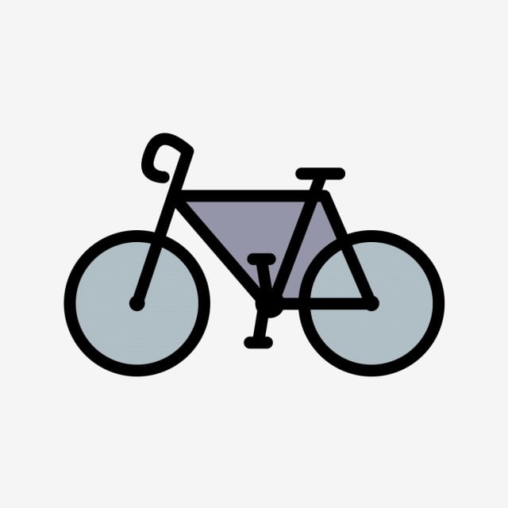

# Interactive clothing

<div id="top"></div>


<!-- PROJECT LOGO -->
<br />
<div align="center">
  <a href="https://github.com/othneildrew/Best-README-Template">
    
  </a>

  <h3 align="center">Interactive clothing for bicyclists</h3>

  <p align="center">
    First-term <b>Principles of Computer Organization</b> course project 
    <br />
        <br />
    <a href="https://github.com/kkulykk/interactive-clothing/blob/main/images/Scheme.png">View Scheme</a>
    ·
    <a href="https://youtu.be/IGkJCaJ5748">View Demo</a>
    ·
    <a href="https://github.com/kkulykk/interactive-clothing/issues">Request Feature</a>
  </p>
    <br />
</div>


<!-- TABLE OF CONTENTS -->
<details>
  <summary>Table of Contents</summary>
  <ol>
    <li>
      <a href="#about-the-project">About The Project</a>
      <ul>
        <li><a href="#built-with">Built With</a></li>
      </ul>
    </li>
    </li>
    <li><a href="#usage">Usage</a></li>
    <li><a href="#roadmap">Roadmap</a></li>
    <li><a href="#contributing">Contributing</a></li>
    <li><a href="#license">License</a></li>
    <li><a href="#contact">Contact</a></li>
  </ol>
</details>


<!-- ABOUT THE PROJECT -->
## About The Project


Nowadays, using eco-friendly means of transport has become a real trend due to the desire of citizens to save the environment. We could see more and more bicycles, scooters and other electro-vehicles on the streets, but the problem is that such drivers are highly unsecured road users. One of the aspects is that during the dark periods drivers could not be clearly seen by car drivers what causes lots of accidents. That is what we actually want to solve with our project.

The idea is to make such interactive clothes for bike-drivers to make them visible during the night. Moreover, we are showing the turn and alarm signals to let car drivers understand what is going on to happen. Another feature is so called "fall detection" which automatically detects if something went wrong and the driver has fallen off the vehicle. If such happens, the clothes automatically shows the alarm signal with an appropriate sound. This feature has a great potential to be developed, e.g. sending a SOS message in case of 1-minute-long unresponsibility of the driver etc.


<p align="right">(<a href="#top">back to top</a>)</p>


### Built With

The technical side of the project is built for STM32 microcontrollers. We used STM32CubeIDE and basic knowledge of C. We also used the folowing sensors:

* WS2812B LED strip
* Piezo speaker (buzzer)
* 2x GY-521 Accelerometers
* External button
* Cables, connectors and wires


<p align="right">(<a href="#top">back to top</a>)</p>


<!-- GETTING STARTED -->
## Usage

Here we describe how to use the clothes.

### To use the clothes as a bicyclist
1. Wear the clothes and place the controlers box into "banana bag" provided and connect to the power source.
2. Connnect necessary modules with the box (check the workability as well).
3. During the ride, show the directions of the desired turn side by raising. the hand to that direction and the clothes will blink showing an appropriate light signal.
3. After the maneuver was completed, the clothes will go back to the "attention state" (blinking red to attract attention).
4. To turn on warning signal manually, press the button on the device.
5. In case of fall, the system will automatically turn on the warning mode, with blinking and producing alarm sounds. When stand up, press the button to turn the warning signal off.


### To use the clothes as a developer

_Below is an example of how you can download and change the source code._

1. Clone the repo
   ```sh
   git clone https://github.com/kkulykk/interactive-clothing.git
   ```
2. Install CubeIDE if needed and open the cloned project directory in IDE. 
3. Go to `Core/Src/main.c` and observe the source code of the project.

<p align="right">(<a href="#top">back to top</a>)</p>


<!-- ROADMAP -->
## Roadmap

- [x] Connect LED-strips
- [x] Make the fall detection prototype
- [x] Connect and configure external accelerometers
- [x] Develop fall detection to work with accelerometers correctly
- [x] Make a scheme using breadboard and wires to debug the system
- [x] Make the clothes
    - [x] Solder the necessary wires to make system modular
    - [x] Create the hull to place the STM and necessary connectors
    - [x] Sew all the necessary sensors on the t-shirt
    - [x] Place the box in the back and check the workability
- [x] Make the wearable device sustainable and bug-free


<p align="right">(<a href="#top">back to top</a>)</p>


<!-- CONTRIBUTING -->
## Contributing

Contributions are what make the open source community such an amazing place to learn, inspire, and create. Any contributions you make are **greatly appreciated**.

If you have a suggestion that would make this better, please fork the repo and create a pull request. You can also simply open an issue with the tag "enhancement".
Don't forget to give the project a star! Thanks again!

1. Fork the Project
2. Create your Feature Branch (`git checkout -b feature/AmazingFeature`)
3. Commit your Changes (`git commit -m 'Add some AmazingFeature'`)
4. Push to the Branch (`git push origin feature/AmazingFeature`)
5. Open a Pull Request

<p align="right">(<a href="#top">back to top</a>)</p>


<!-- LICENSE -->
## License

Distributed under the MIT License. See `LICENSE.txt` for more information.

<p align="right">(<a href="#top">back to top</a>)</p>


<!-- CONTACT -->
## Contacts
Mentor - Oleh Fareniuk

Bohdan Mykhailiv - [Github](https://github.com/bmykhaylivvv)

Roman Kulyk - [Github](https://github.com/kkulykk)


<p align="right">(<a href="#top">back to top</a>)</p>


